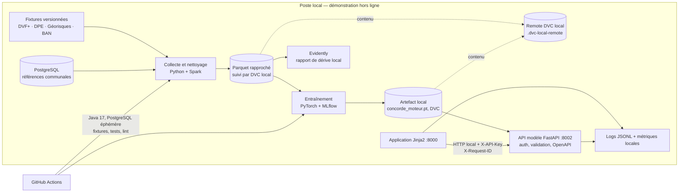

# Architecture technique et applicative — C15

## Décision structurante

Le système est séparé en quatre frontières simples : données, moteur, API
modèle et application. Chaque frontière a un contrat et peut être vérifiée sans
Internet. Le navigateur ne charge aucun poids de modèle et l'application ne
réimplémente jamais la décision du moteur.



## Composants et responsabilités

| Composant | Responsabilité | Dépendances | Preuve |
|---|---|---|---|
| `src/concorde/collect/` | Rejouer six collectes locales, dont DPE avec Spark. | Fichiers fixtures, PostgreSQL local. | `concorde.collect`, tests data. |
| `src/concorde/clean/` et modèle | Normaliser, rapprocher, entraîner et servir l'artefact PyTorch. | Parquet traité, PyTorch, MLflow. | Fiche modèle, métriques et tests. |
| `api/data/` | Exposer la synthèse communale REST. | PostgreSQL, clé API. | OpenAPI et test de filtre. |
| `api/model/` | Exposer `/predict`, `/sante`, transparence et métriques. | Artefact local, clé API. | OpenAPI et tests de contrat. |
| `app/` | Restituer un verdict compréhensible et accessible. | API modèle sur `127.0.0.1:8002`. | Test hors ligne et parcours HTML. |
| `monitoring/` | Conserver logs pseudonymisés, compteurs et rapport de dérive. | Disque local. | JSONL, JSON métriques, Evidently. |

## Flux, sécurité et résilience

1. La chaîne transforme les fixtures en rapprochements et produit un artefact
   local gelé. L'API modèle le charge une seule fois au démarrage.
2. L'application adresse une requête HTTP à `127.0.0.1:8002`, avec une clé
   interne et un `X-Request-ID`. L'API valide le contrat Pydantic, répond avec
   les trois axes et journalise le même identifiant.
3. Si l'artefact ou l'API est indisponible, l'application rend une page 503
   explicite ; elle ne fabrique pas de résultat de secours.
4. `enable_offline_guard()` interdit toute connexion non locale au démarrage de
   l'app et des APIs. Cette mesure rend visible une dépendance réseau future
   avant la démonstration.

Les outils sont volontairement peu nombreux : Python 3.12, PyTorch, Spark 3.5
sur Java 17, PostgreSQL 17, FastAPI/Jinja2, MLflow, DVC, Evidently, Docker et
GitHub Actions. Aucun cloud, CDN ou registre d'images n'est nécessaire pour
exécuter la démo préparée localement.

DVC est réellement initialisé : les métadonnées
`data/processed/rapprochements.parquet.dvc` et `models/concorde_moteur.pt.dvc`
sont versionnées dans Git, tandis que leur contenu est copié dans le remote
strictement local `.dvc-local-remote/`. Il ne s'agit donc ni d'une promesse de
versionnement ni d'un stockage distant.

## POC et reproductibilité

Le POC est la tranche verticale documentée dans le README :

```bash
source scripts/spark-env.sh
uv run python -m concorde.collect
uv run python -m concorde.clean
uv run python -m concorde.model.entrainement
uv run pytest -m "not local_service"
```

La contrainte Java 17 n'est pas décorative : Spark 3.5 échoue avec le JDK 26
présent sur le poste (`Subject.getSubject is not supported`). Le script
`scripts/spark-env.sh` et la CI fixent donc explicitement Java 17.
