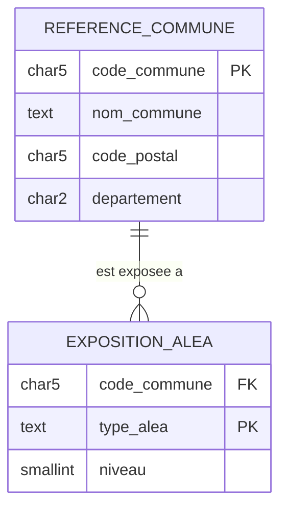

# Modele de donnees — C4

## MCD



Une commune peut avoir zero ou plusieurs aleas. Un alea est identifie par le
couple `(code_commune, type_alea)` ; la base ne stocke ni proprietaire, ni
adresse complete, ni personne physique.

## MPD et installation

Le MPD PostgreSQL versionne est [schema.sql](sql/schema.sql). Il definit les
cles, la contrainte de code INSEE, les index de filtre et l'integrite
referentielle. La base locale est lancee et peuplee ainsi :

```bash
docker compose up -d postgres
source scripts/spark-env.sh
.venv/bin/python scripts/import_postgres.py
.venv/bin/python -m pytest tests/data/test_collecte_postgres.py -q
```

L'import est idempotent (`ON CONFLICT DO UPDATE`) : il peut etre rejoue devant
le jury sans dupliquer de lignes.
